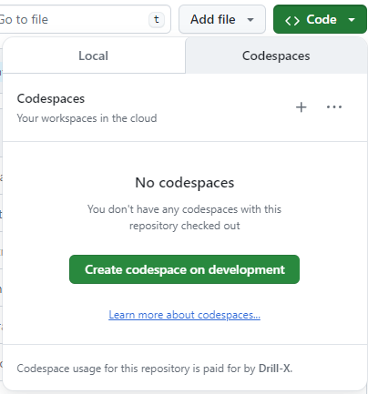
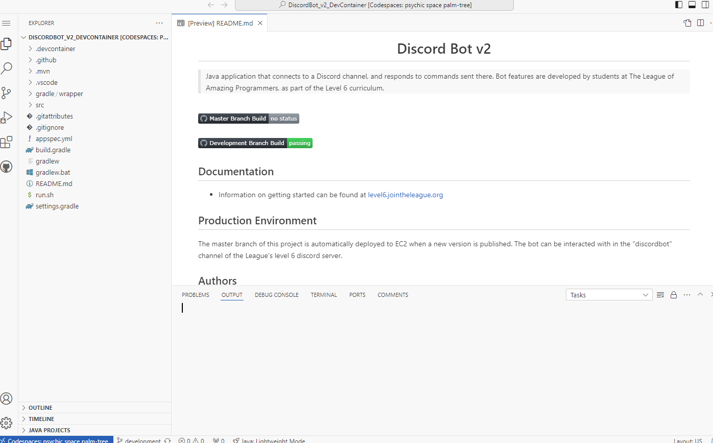
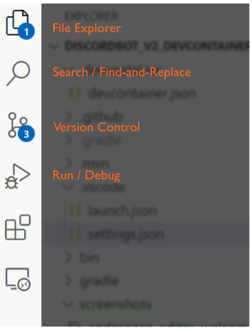

<h1 style="text-align:center">Discord Bot v2</h1>

> Java application that connects to a Discord channel, and responds to commands sent there.
>  Bot features are developed by students at The League of Amazing Programmers, as part of the Level 6 curriculum.

 
 
 
 

## Documentation

- Information on getting started can be found at [level6.jointheleague.org](https://level6.jointheleague.org)

## Using Codespaces

This repository has been set up to work with GitHub codespaces!
Codespaces allow you to \<DO STUFF\>

Here are the basic steps needed to open this repository in a codespace:

1) Click on the green "Code" button like you usually would to get the url for cloning 
locally, but select the "Codespaces" tab at the top instead.
 

    

2) Click the green "create codespace" button.  This will open another tab which, after 
a few minutes of loading, will become a Visual Studio Code browser editor.
 

    

4) The browser-based editor is basically idential to the normal Visual Stuio Code 
app, but for those who are not familiar with it, the tabs on the left cover most of 
the basic functions you might be used to from Eclipse and IntelliJ.
 

   

## Production Environment 

The master branch of this project is automatically deployed to EC2 when a new version is published.
The bot can be interacted with in the "discordbot" channel of the League's level 6 discord server.

## Authors

👤 **Matt Freedman**
- Email: [matt.freedman@jointheleague.org](mailto:matt.freedman@jointheleague.org)
- Github: [@mjfre](https://github.com/mjfre)

👤 **Keith Groves**
- Email: [keith.groves@jointheleague.org](mailto:keith.groves@jointheleague.org)
- Github: [@keithagroves](https://github.com/keithagroves)

AND

👥 **Students @ [The League of Amazing Programmers](https://www.jointheleague.org)**
- Email: [info@jointheleague.org](mailto:info@jointheleague.org)
- Github: [@jointheleague](https://github.com/jointheleague)
