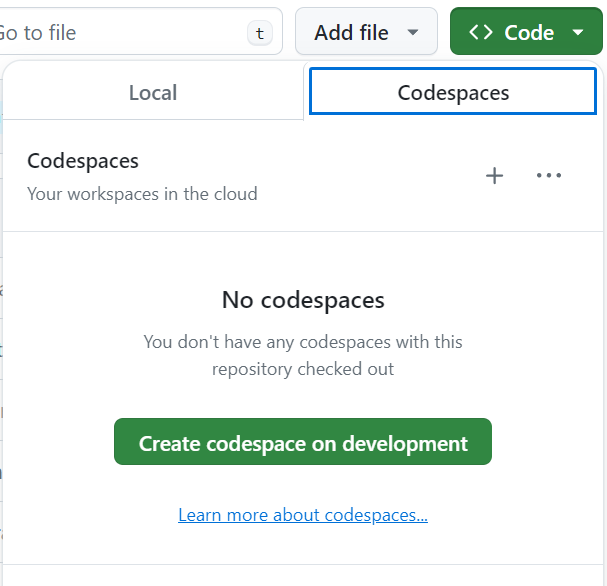

<h1 style="text-align:center">Discord Bot v2</h1>

> Java application that connects to a Discord channel, and responds to commands sent there.
>  Bot features are developed by students at The League of Amazing Programmers, as part of the Level 6 curriculum.

 
 
 
 

## Documentation

- Information on getting started can be found at [level6.jointheleague.org](https://level6.jointheleague.org)

## Using Codespaces

This repository has been set up to work with GitHub codespaces!
Codespaces allow you to develop with a GirHub repository directly in your 
browser without having to set up a local environment.

Here are the basic steps needed to open this repository in a codespace:

(These instructions are current as of 2024-06-23)

1) Before you open your codespace, in order to run your Discord bot, you need 
to provide a token. If you weredeveloping locally this would usually be done 
with an environment variable. The most secure way to do this with a GitHub 
codespace is to use a GitHub secret.

    Under the repository settings, there is a tab called "secrets and 
    variables." Open click the down arrow next to it and select 
    "codespaces." Then, click the green "new repository secret" button.

    

2) Make sure the name of this secret is exactly `DISCORD_TOKEN` and 
contains only your api token, or the bot won't recognize it correctly.

    

3) You can create another secret called `CHANNEL_NAME` to set your bot's 
active channel, or you can edit the devcontainer.json instead.

4) Now to actually open a new codespace. First, click on the green "Code" 
button like you usually would to get the url for cloning 
locally, but select the "Codespaces" tab at the top instead.

    

5) Click the green "create codespace" button. This will open another tab 
which, after a few minutes of loading, will become a Visual Studio Code 
browser editor.

    

6) The browser-based editor is basically identical to the normal Visual 
Studio Code app, but for those who are not familiar with it, the tabs on 
the left cover most of the basic functions you might be used to from 
Eclipse and IntelliJ.

   

## Production Environment 

The master branch of this project is automatically deployed to EC2 when a new version is published.
The bot can be interacted with in the "discordbot" channel of the League's level 6 discord server.

## Authors

👤 **Matt Freedman**
- Email: [matt.freedman@jointheleague.org](mailto:matt.freedman@jointheleague.org)
- Github: [@mjfre](https://github.com/mjfre)

👤 **Keith Groves**
- Email: [keith.groves@jointheleague.org](mailto:keith.groves@jointheleague.org)
- Github: [@keithagroves](https://github.com/keithagroves)

AND

👥 **Students @ [The League of Amazing Programmers](https://www.jointheleague.org)**
- Email: [info@jointheleague.org](mailto:info@jointheleague.org)
- Github: [@jointheleague](https://github.com/jointheleague)
